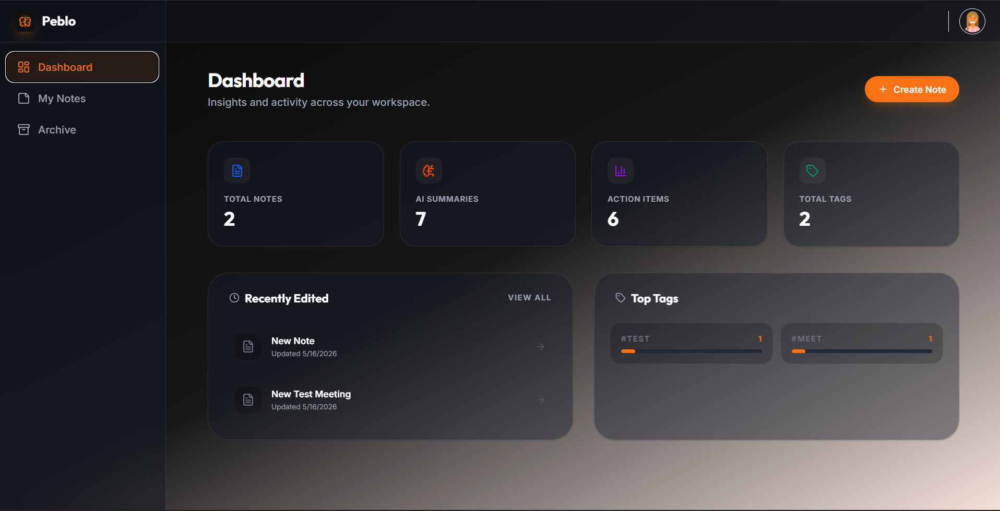
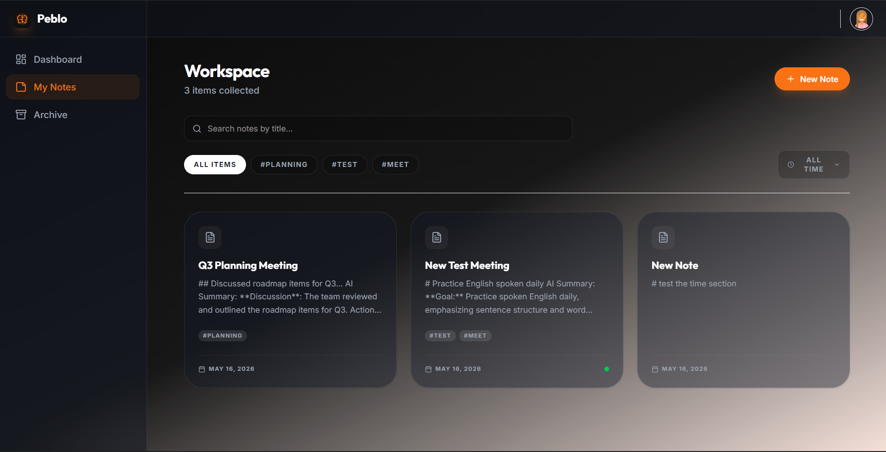

# Peblo — Collaborative AI Notes

> An AI-powered full-stack notes application that automatically generates summaries, action items, and suggested titles from your notes using a large language model.

---

## Table of Contents

1. [Architecture Overview](#architecture-overview)
2. [Tech Stack](#tech-stack)
3. [Project Structure](#project-structure)
4. [Prerequisites](#prerequisites)
5. [Environment Variables](#environment-variables)
6. [Installation & Setup](#installation--setup)
7. [Running the Application](#running-the-application)
8. [Running Tests](#running-tests)
9. [API Reference](#api-reference)
10. [Database Schema](#database-schema)
11. [Sample Outputs](#sample-outputs)
12. [Screenshots](#screenshots)
13. [Deployment & Docker](#deployment--docker)

---

## Architecture Overview

```
┌────────────────────────────────────────────────────────┐
│                     Client Browser                     │
│          React 19 + TypeScript (Vite + Tailwind)       │
└────────────────────────┬───────────────────────────────┘
                         │  HTTP / JSON  (port 5173)
                         ▼
┌────────────────────────────────────────────────────────┐
│              Django REST Framework Backend              │
│                   (port 8000)                          │
│                                                        │
│  ┌──────────────┐   ┌──────────────┐  ┌────────────┐  │
│  │  Auth Views  │   │  Note Views  │  │  Insights  │  │
│  │  (JWT)       │   │  CRUD + AI   │  │  View      │  │
│  └──────────────┘   └──────┬───────┘  └────────────┘  │
│                            │                           │
│                   ┌────────▼────────┐                  │
│                   │   agent.py      │                  │
│                   │  (Groq LLM API) │                  │
│                   └────────┬────────┘                  │
│                            │  HTTPS                    │
│                            ▼                           │
│                   ┌─────────────────┐                  │
│                   │   Groq Cloud    │                  │
│                   │ (openai-compat) │                  │
│                   └─────────────────┘                  │
│                                                        │
│  ┌──────────────────────────────────────────────────┐  │
│  │            SQLite Database (dev)                 │  │
│  │   notes_api_user  │  notes_api_note              │  │
│  └──────────────────────────────────────────────────┘  │
└────────────────────────────────────────────────────────┘
```

### Key Design Decisions

| Decision | Rationale |
|---|---|
| **UUID4 primary keys** | Avoids sequential ID enumeration attacks, safe to expose in URLs |
| **JWT authentication** (via `simplejwt`) | Stateless auth; 7-day access tokens for usability |
| **Custom `AbstractUser`** | Email as username, no username field, per-user AI usage counters |
| **Groq API (OpenAI-compatible)** | Fast inference, returns structured JSON via `response_format` |
| **SQLite (dev)** | Zero-config for local development; swap for Postgres in production |
| **Vite + React 19** | Instant HMR, modern bundling, no Create React App overhead |
| **Tailwind CSS v4** | Utility-first dark-mode design with glassmorphism components |

---

## Tech Stack

### Backend
- **Python 3.12** — Runtime
- **Django 5.x** — Web framework
- **Django REST Framework** — API layer
- **djangorestframework-simplejwt** — JWT authentication
- **django-cors-headers** — CORS policy
- **Groq Python SDK** — LLM integration (OpenAI-compatible)
- **python-dotenv** — Environment variable loading
- **SQLite** — Database (development)

### Frontend
- **React 19** + **TypeScript**
- **Vite 6** — Dev server & bundler
- **Tailwind CSS v4** — Styling
- **React Router DOM v7** — Client-side routing
- **Axios** — HTTP client
- **Lucide React** — Icon library
- **Motion (Framer Motion)** — Animations
- **React Markdown** — Markdown rendering for AI outputs

---

## Project Structure

```
Collabrative_AI_Notes/
├── .env.example                  # Template for environment variables
├── README.md
│
├── Backend/
│   └── AI_Notes/
│       ├── manage.py
│       ├── db.sqlite3
│       ├── AI_Notes/             # Django project config
│       │   ├── settings.py
│       │   ├── urls.py
│       │   └── wsgi.py
│       └── notes_api/            # Main Django app
│           ├── models.py         # User & Note models (UUID PKs)
│           ├── serializers.py    # DRF serializers
│           ├── views.py          # All API views
│           ├── urls.py           # URL routing
│           ├── agent.py          # Groq LLM integration
│           ├── admin.py
│           └── migrations/
│
└── Frontend/
    ├── index.html
    ├── package.json
    ├── vite.config.ts
    ├── tailwind.config.ts
    └── src/
        ├── main.tsx
        ├── App.tsx               # Root layout, routing, auth guard
        ├── index.css             # Global styles & design tokens
        ├── services/
        │   └── api.ts            # Axios instance + interceptors
        ├── context/
        │   └── AuthContext.tsx   # Global auth state
        └── pages/
            ├── Auth.tsx          # Login / Register
            ├── Dashboard.tsx     # Stats & recent notes
            ├── Notes.tsx         # Notes list & search
            ├── NoteEditor.tsx    # Rich note editor + AI trigger
            ├── Archive.tsx       # Archived notes
            └── PublicNote.tsx    # Public shared note view
```

---

## Prerequisites

- **Python 3.10+**
- **[uv](https://docs.astral.sh/uv/)** *(recommended)* — fast Python package & project manager
- **Node.js 18+** and **npm 9+**
- A **Groq API key** — get one free at [console.groq.com](https://console.groq.com)

### Installing uv

```bash
# macOS / Linux
curl -LsSf https://astral.sh/uv/install.sh | sh

# Windows (PowerShell)
powershell -ExecutionPolicy ByPass -c "irm https://astral.sh/uv/install.ps1 | iex"

# Or via pip
pip install uv
```

> `uv` replaces `pip` + `venv` with a single, significantly faster tool.

---

## Environment Variables

Copy the template and fill in your values in the root directory:

```bash
cp .env.example .env
```

| Variable | Description | Default |
|---|---|---|
| `SECRET_KEY` | Django secret key for signing tokens | `django-insecure...` |
| `GROQ_API_KEY` | Your Groq API key for AI generation | **Required** |
| `DATABASE_URL` | Database URL (Postgres/MySQL) | Optional (SQLite) |
| `DEBUG` | Enable/Disable debug mode | `True` |
| `ALLOWED_HOSTS` | List of allowed hostnames | `localhost 127.0.0.1` |
| `CORS_ALLOWED_ORIGINS` | Allowed origins for CORS | `http://localhost:5173` |

> ⚠️ **Never commit real credentials.** The `.env` file is (and must remain) in `.gitignore`.

---

## Installation & Setup

### 1. Clone the repository

```bash
git clone <repository-url>
cd Collabrative_AI_Notes
```

### 2. Backend Setup

#### Option A — Using `uv` *(recommended)*

```bash
cd Backend/AI_Notes

# Create a virtual environment and install all dependencies in one step
uv venv
source .venv/bin/activate          # Windows: .venv\Scripts\activate

uv pip install django djangorestframework djangorestframework-simplejwt \
               django-cors-headers groq python-dotenv

# Create your .env file
echo "GROQ_API_KEY=your_key_here" > .env

# Apply database migrations
python manage.py migrate

# (Optional) Create a Django superuser for the admin panel
python manage.py createsuperuser
```

#### Option B — Using `pip` (standard)

```bash
cd Backend/AI_Notes

# Create and activate a virtual environment
python3 -m venv venv
source venv/bin/activate          # Windows: venv\Scripts\activate

# Install Python dependencies
pip install django djangorestframework djangorestframework-simplejwt \
            django-cors-headers groq python-dotenv

# Create your .env file
echo "GROQ_API_KEY=your_key_here" > .env

# Apply database migrations
python manage.py migrate

# (Optional) Create a Django superuser for the admin panel
python manage.py createsuperuser
```

### 3. Frontend Setup

```bash
cd ../../Frontend

# Install Node.js dependencies
npm install
```

---

## Running the Application

### Start the Backend (Django)

```bash
cd Backend/AI_Notes

# uv
source .venv/bin/activate

# pip
# source venv/bin/activate

python manage.py runserver
# Server starts at http://127.0.0.1:8000
```

### Start the Frontend (Vite)

```bash
cd Frontend
npm run dev
# Dev server starts at http://localhost:5173
```

Open **http://localhost:5173** in your browser.

> The frontend proxy is not configured — the React app calls `http://127.0.0.1:8000/api/` directly via Axios.

---

## Running Tests

### Backend

```bash
cd Backend/AI_Notes
source .venv/bin/activate   # or: source venv/bin/activate (pip)
python manage.py test notes_api
```

### Frontend (Type checking)

```bash
cd Frontend
npm run lint        # runs tsc --noEmit
```

---

## API Reference

All endpoints are prefixed with `/api/`. Authentication uses **Bearer JWT tokens** in the `Authorization` header.

### Authentication

| Method | Endpoint | Auth | Description |
|---|---|---|---|
| `POST` | `/api/auth/signup` | Public | Register a new user |
| `POST` | `/api/auth/login` | Public | Login and receive JWT |

**POST `/api/auth/signup`**
```json
// Request
{ "name": "Alex", "email": "alex@example.com", "password": "securepass123" }

// Response 201
{
  "token": "eyJhbGciOiJIUzI1NiIsInR5cCI6IkpXVCJ9...",
  "user": {
    "id": "550e8400-e29b-41d4-a716-446655440000",
    "name": "Alex",
    "email": "alex@example.com"
  }
}
```

**POST `/api/auth/login`**
```json
// Request
{ "email": "alex@example.com", "password": "securepass123" }

// Response 200
{
  "token": "eyJhbGciOiJIUzI1NiIsInR5cCI6IkpXVCJ9...",
  "user": {
    "id": "550e8400-e29b-41d4-a716-446655440000",
    "name": "Alex",
    "email": "alex@example.com"
  }
}
```

---

### Notes

| Method | Endpoint | Auth | Description |
|---|---|---|---|
| `GET` | `/api/notes` | 🔒 Required | List all active (non-archived) notes |
| `POST` | `/api/notes` | 🔒 Required | Create a new note |
| `GET` | `/api/notes/<uuid:pk>` | 🔒 Required | Retrieve a single note |
| `PATCH` | `/api/notes/<uuid:pk>` | 🔒 Required | Update a note (partial) |
| `DELETE` | `/api/notes/<uuid:pk>` | 🔒 Required | Delete a note |
| `POST` | `/api/notes/<uuid:pk>/ai` | 🔒 Required | Generate AI summary for a note |
| `GET` | `/api/notes/archived` | 🔒 Required | List archived notes |
| `GET` | `/api/shared/<uuid:shareId>` | Public | View a publicly shared note |

**GET `/api/notes` — Response 200**
```json
[
  {
    "id": "550e8400-e29b-41d4-a716-446655440000",
    "title": "Q3 Planning Meeting",
    "body": "Discussed roadmap items for Q3...",
    "summary": "The team aligned on three key deliverables for Q3...",
    "tags": ["planning", "roadmap"],
    "action_items": ["Schedule follow-up with design team", "Update Jira board"],
    "suggested_title": "Q3 Roadmap Planning Session",
    "userId": "f47ac10b-58cc-4372-a567-0e02b2c3d479",
    "archived": false,
    "public": false,
    "shareId": "550e8400-e29b-41d4-a716-446655440000",
    "created_at": "2026-05-14T10:30:00Z",
    "updated_at": "2026-05-16T09:00:00Z"
  }
]
```

**POST `/api/notes/<uuid>/ai` — AI Generation Response 200**
```json
{
  "summary": "The team discussed the **Q3 roadmap** and aligned on three key deliverables. Focus areas include improving `onboarding flow` and shipping the new dashboard.",
  "action_items": [
    "Schedule follow-up with the **design team** by Friday",
    "Update the Jira board with new sprint tickets",
    "Share roadmap doc with all stakeholders"
  ],
  "suggested_title": "Q3 Roadmap Alignment Meeting"
}
```

---

### Insights

| Method | Endpoint | Auth | Description |
|---|---|---|---|
| `GET` | `/api/insights` | 🔒 Required | Get dashboard stats for the current user |

**GET `/api/insights` — Response 200**
```json
{
  "totalNotes": 12,
  "recentNotes": [ /* last 3 NoteSerializer objects */ ],
  "mostUsedTags": [
    { "tag": "planning", "count": 5 },
    { "tag": "backend", "count": 3 }
  ],
  "aiStats": {
    "summaries": 8,
    "actionItems": 24
  }
}
```

---

## Database Schema

### `notes_api_user`

| Column | Type | Constraints |
|---|---|---|
| `id` | `char(32)` (UUID4) | PRIMARY KEY |
| `email` | `varchar(254)` | UNIQUE, NOT NULL |
| `name` | `varchar(255)` | nullable |
| `password` | `varchar(128)` | NOT NULL (hashed) |
| `total_summaries_generated` | `INTEGER` | NOT NULL, default 0 |
| `total_action_items_generated` | `INTEGER` | NOT NULL, default 0 |
| `is_active` | `bool` | NOT NULL |
| `is_staff` | `bool` | NOT NULL |
| `is_superuser` | `bool` | NOT NULL |
| `date_joined` | `datetime` | NOT NULL |
| `last_login` | `datetime` | nullable |

### `notes_api_note`

| Column | Type | Constraints |
|---|---|---|
| `id` | `char(32)` (UUID4) | PRIMARY KEY |
| `title` | `varchar(255)` | NOT NULL |
| `body` | `TEXT` | NOT NULL |
| `summary` | `TEXT` | nullable |
| `tags` | `TEXT` (JSON array) | NOT NULL, default `[]` |
| `action_items` | `TEXT` (JSON array) | NOT NULL, default `[]` |
| `suggested_title` | `varchar(255)` | nullable |
| `owner_id` | `char(32)` (UUID4) | FK → `notes_api_user.id` |
| `is_archived` | `bool` | NOT NULL, default `false` |
| `is_shared` | `bool` | NOT NULL, default `false` |
| `created_at` | `datetime` | NOT NULL, auto |
| `updated_at` | `datetime` | NOT NULL, auto |

### Entity Relationship

```
notes_api_user (1) ────< notes_api_note (many)
       id (UUID PK)            id (UUID PK)
                               owner_id (FK)
```

---

## Sample Outputs

### Example: Signup Response

```json
{
  "token": "eyJhbGciOiJIUzI1NiIsInR5cCI6IkpXVCJ9.eyJ0b2tlbl90eXBlIjoiYWNjZXNzIiwiZXhwIjoxNzQ3OTM2MDAwfQ.abc123",
  "user": {
    "id": "550e8400-e29b-41d4-a716-446655440000",
    "name": "Alex",
    "email": "alex@example.com"
  }
}
```

### Example: AI-Generated Summary

Given a note body about a team standup meeting, the AI returns:

```json
{
  "summary": "The standup covered **sprint progress** and identified a blocker in the `payment integration` module. The team is on track for the Thursday release.",
  "action_items": [
    "Resolve the **Stripe webhook** timeout issue — assigned to Dev Team",
    "Update staging environment with the latest migration",
    "Send release notes draft to `#announcements` by Wednesday"
  ],
  "suggested_title": "Sprint Standup — Payment Module Blocker"
}
```

### Example: Insights Response

```json
{
  "totalNotes": 12,
  "mostUsedTags": [
    { "tag": "planning", "count": 5 },
    { "tag": "backend", "count": 3 },
    { "tag": "design", "count": 2 }
  ],
  "aiStats": {
    "summaries": 8,
    "actionItems": 24
  }
}
```

### Example: Public Shared Note

```json
{
  "title": "How We Ship Features at Peblo",
  "content": "Our shipping process follows a three-phase model...",
  "tags": ["process", "engineering"],
  "updatedAt": "2026-05-16T09:00:00Z"
}
```

---

## Screenshots

### 📊 Dashboard


### 📝 Notes & Filtering


---

## Deployment & Docker

The application is fully containerized and ready for production deployment via Docker Compose.

### Quick Start with Docker

1. Ensure you have **Docker** and **Docker Compose** installed.
2. Configure your `.env` file (at minimum add `GROQ_API_KEY`).
3. Build and run the entire stack (run this from the **root directory**):
   ```bash
   docker-compose up --build
   ```
4. Access the application:
   - **Frontend:** `http://localhost`
   - **Backend API:** `http://localhost:8000/api`
   - **Database:** PostgreSQL (internal to Docker)

### Manual Production Build

- **Backend:**
  - Serve via `gunicorn AI_Notes.wsgi:application`.
  - Static files are served via **WhiteNoise**.
  - Migrations run automatically in the Docker entrypoint.
- **Frontend:**
  - Build: `npm run build`.
  - Serve the `dist/` folder via **Nginx** (config provided in `Frontend/nginx.conf`).
